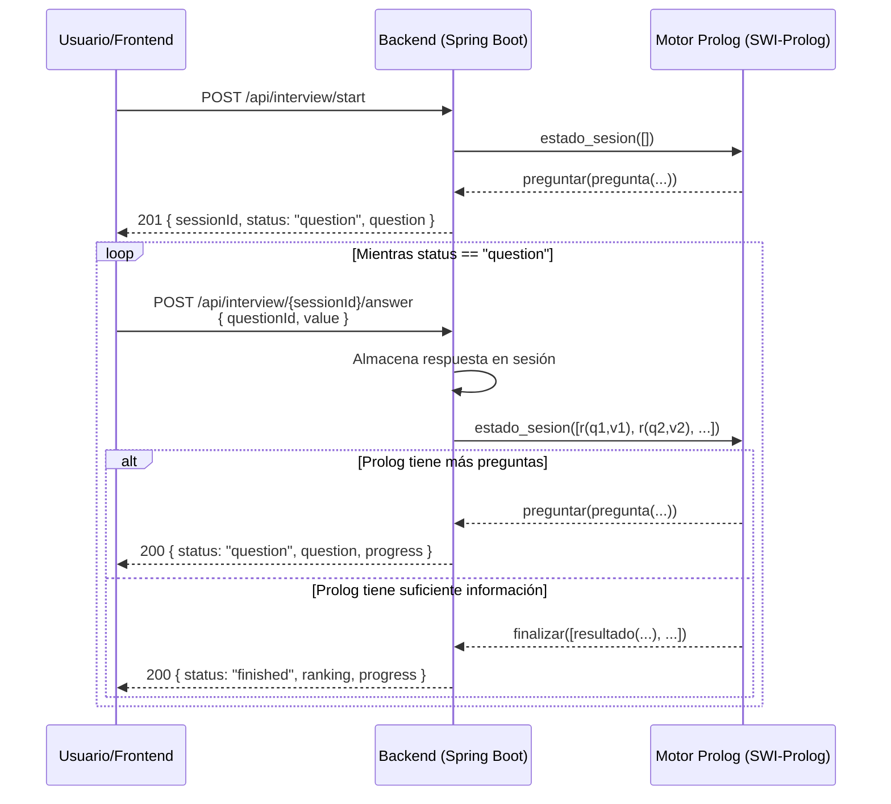

# Vocatio — Flujo Completo de la API

## Contexto

Vocatio es un sistema experto vocacional que, mediante una entrevista adaptativa, infiere qué carreras universitarias son más afines a los gustos del usuario. El motor de inferencia está implementado en **SWI-Prolog** y se comunica con el backend **Spring Boot** a través de **JPL (Java Prolog Library)**.

La entrevista es dinámica: Prolog elige la siguiente pregunta en función de las respuestas anteriores, descartando preguntas irrelevantes y profundizando en las áreas de mayor interés del usuario.

---

## Endpoints

| Método | Ruta | Descripción |
|--------|------|-------------|
| `POST` | `/api/interview/start` | Inicia una nueva sesión de entrevista |
| `POST` | `/api/interview/{sessionId}/answer` | Envía la respuesta a una pregunta |

---

## Diagrama de Secuencia



---

## 1. Iniciar Entrevista

### Request

```
POST /api/interview/start
Content-Type: application/json
```

No requiere body.

### Response — `201 Created`

```json
{
  "sessionId": "85dd3db6-71cb-43da-aa3e-caf9b8911012",
  "status": "question",
  "question": {
    "id": "q_interes_tecnologia",
    "text": "Cuanto te interesa la tecnologia, las computadoras o el mundo digital?",
    "area": "tecnologia",
    "type": "general"
  }
}
```

| Campo | Tipo | Descripción |
|-------|------|-------------|
| `sessionId` | `string` | UUID de la sesión. Necesario para todas las respuestas posteriores |
| `status` | `string` | Siempre `"question"` en el inicio |
| `question.id` | `string` | Identificador único de la pregunta (se envía de vuelta al responder) |
| `question.text` | `string` | Texto de la pregunta a mostrar al usuario |
| `question.area` | `string` | Área temática (`tecnologia`, `humanidades`, `salud`, etc.) |
| `question.type` | `string` | `"general"` (exploratoria) o `"especifica"` (profundización) |

---

## 2. Responder una Pregunta

### Request

```
POST /api/interview/{sessionId}/answer
Content-Type: application/json
```

```json
{
  "questionId": "q_interes_tecnologia",
  "value": 5
}
```

| Campo | Tipo | Validación | Descripción |
|-------|------|-----------|-------------|
| `questionId` | `string` | Obligatorio, no vacío | ID de la pregunta que se está respondiendo |
| `value` | `integer` | Obligatorio, entre 1 y 5 | Nivel de afinidad del usuario (1 = nada, 5 = mucho) |

### Response A — Siguiente Pregunta (`200 OK`)

Si Prolog determina que necesita más información:

```json
{
  "status": "question",
  "question": {
    "id": "q_programacion",
    "text": "Cuanto te atrae programar, crear software o automatizar tareas?",
    "area": "tecnologia",
    "type": "especifica"
  },
  "progress": {
    "answered": 1,
    "minQuestions": 8,
    "maxQuestions": 15
  }
}
```

### Response B — Resultado Final (`200 OK`)

Cuando Prolog tiene suficiente información para inferir las carreras afines (entre `minQuestions` y `maxQuestions` respuestas):

```json
{
  "status": "finished",
  "progress": {
    "answered": 15,
    "minQuestions": 8,
    "maxQuestions": 15
  },
  "ranking": [
    {
      "careerId": "ingenieria_sistemas",
      "careerName": "Ingenieria en Sistemas",
      "percentage": 82,
      "summary": "Se recomienda Ingenieria en Sistemas porque: muestra interes en tecnologia; le interesa crear aplicaciones...",
      "activatedRules": [
        {
          "id": "r_sis_tecnologia",
          "description": "muestra interes en tecnologia",
          "score": 10
        },
        {
          "id": "r_sis_software",
          "description": "le interesa crear aplicaciones o sistemas digitales",
          "score": 8
        }
      ]
    }
  ]
}
```

| Campo | Tipo | Descripción |
|-------|------|-------------|
| `ranking` | `array` | Lista de carreras ordenadas por afinidad |
| `ranking[].careerId` | `string` | Identificador interno de la carrera |
| `ranking[].careerName` | `string` | Nombre legible de la carrera |
| `ranking[].percentage` | `integer` | Porcentaje de afinidad (0-100) |
| `ranking[].summary` | `string` | Resumen en lenguaje natural de por qué se recomienda |
| `ranking[].activatedRules` | `array` | Reglas del sistema experto que se activaron |
| `ranking[].activatedRules[].id` | `string` | ID de la regla |
| `ranking[].activatedRules[].description` | `string` | Descripción legible de la regla |
| `ranking[].activatedRules[].score` | `integer` | Puntaje asignado por esta regla |

### Response C — Error de Validación (`400 Bad Request`)

```json
{
  "error": "El valor de la respuesta debe estar entre 1 y 5."
}
```

---

## Flujo Resumido

```
1. Frontend → POST /api/interview/start
   ← Recibe sessionId + primera pregunta

2. Frontend muestra la pregunta al usuario

3. Usuario responde (valor 1-5)

4. Frontend → POST /api/interview/{sessionId}/answer { questionId, value }
   ← Recibe:
      • status "question" → mostrar nueva pregunta (volver al paso 2)
      • status "finished" → mostrar ranking de carreras (fin)

5. Repetir pasos 2-4 hasta recibir "finished"
```

---

## Ejemplo Completo con cURL

```bash
# 1. Iniciar entrevista
curl -s -X POST http://localhost:8080/api/interview/start \
  -H "Content-Type: application/json"

# Respuesta: { "sessionId": "abc-123", "question": { "id": "q_interes_tecnologia", ... } }

# 2. Responder primera pregunta
curl -s -X POST http://localhost:8080/api/interview/abc-123/answer \
  -H "Content-Type: application/json" \
  -d '{ "questionId": "q_interes_tecnologia", "value": 5 }'

# Respuesta: { "status": "question", "question": { "id": "q_programacion", ... } }

# 3. Seguir respondiendo hasta recibir status "finished"...
```

---

## Swagger UI

Disponible en: **<http://localhost:8080/swagger-ui.html>**

---

## Notas Técnicas

- La sesión se almacena **en memoria** (no hay base de datos). Se pierde al reiniciar el servidor.
- El número de preguntas varía entre **8 y 15** según las respuestas del usuario.
- Prolog adapta las preguntas dinámicamente: si el usuario muestra alto interés en tecnología, profundiza con preguntas de programación, IA, datos, etc.
- Los `questionId` devueltos por el server son los que se deben enviar de vuelta al responder. No se deben inventar IDs.
